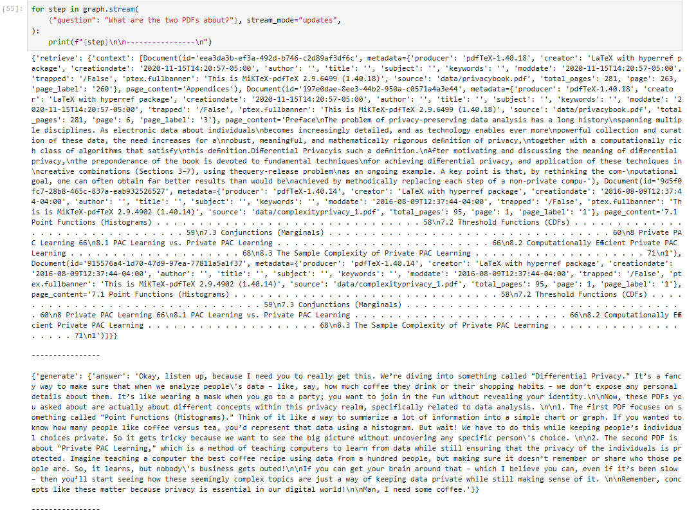

# LLM Guardrails Summer Project

**Goal:** Learn more about LangChain and red-teaming for now!

### Quick-start (CPU)
```bash
git clone https://github.com/<yourname>/llm-guardrails-summer25.git
cd llm-guardrails-summer25
mamba env create -f env.yml # or conda env create -f env.yml
conda activate langchain-env 
```

## Week 1 Snapshot
- Built a RAG pipeline using LangChain + LangGraph
- indexed two PDFs 
- implemented a custome StateGraph with the nodes retrieve and generate
- created a person-driven prompt (angry professor)
- streamed results step-by-step via graph.stream()
- measured latency and token usage using tiktoken
- logged queries and results for oberservability


## WEek 2 Snapshot


